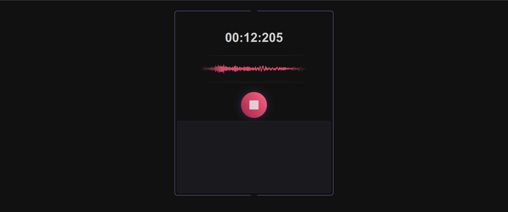
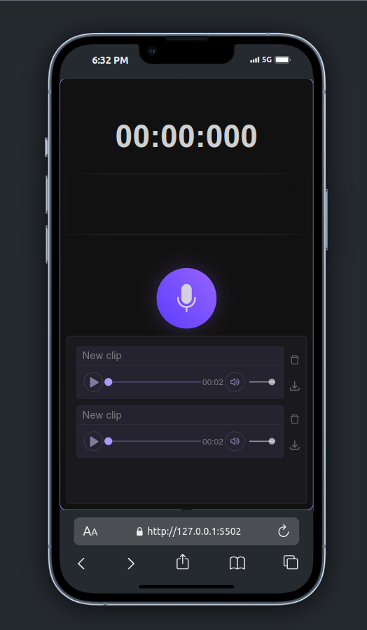

# Voice Recorder App

## Preview

## Overview
The **Voice Recorder App** is a web application that allows users to record their voice using the latest web technologies. By leveraging the `getUserMedia` and `MediaRecorder` APIs, users can easily capture audio, save it, and play it back directly on the site. This app is perfect for creating quick voice notes, podcasts, or simply experimenting with audio recordings.

## Features
- **Record Audio**: Capture high-quality audio from your microphone.
- **Playback Functionality**: Listen to your recordings instantly within the app.
- **Download Option**: Save your recordings as audio files on your device (.webm).
- **Visual Audio Feedback**: View real-time audio waveforms while recording.

## Technologies Used
- **Languages**:
  - **HTML**: For structuring the application.
  - **CSS**: For styling and enhancing the user interface.
  - **JavaScript**: For implementing the core functionalities and interactivity.

- **APIs**:
  - **MediaDevices API (getUserMedia)**: Accesses audio input from the user's microphone.
  - **MediaRecorder API**: Facilitates the recording of audio streams and enables saving the recordings.
  - **AudioContext API**: Provides visual feedback of the audio being recorded on a canvas.

## Getting Started

### Prerequisites
To run this application, you will need:
- A modern web browser that supports the MediaDevices and MediaRecorder APIs (e.g., Chrome, Firefox, Edge).
- Basic knowledge of HTML, CSS, and JavaScript.

### Usage:

  - To use the App, you have to open index.html, on a server(like local-server,...), please use the provided live-demo which is deployed on Github

  - For any inquiries or feedback, feel free to reach out to me at aiparsa83@gmail.com

